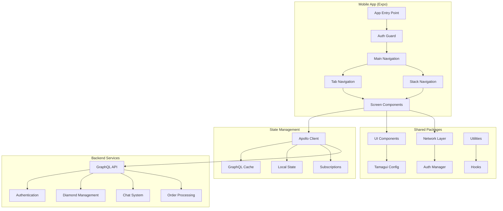

# Carat Central Expo App - Design Document

## Overview

The Carat Central Expo App is a sophisticated mobile application built with Expo Router, React Native, and Tamagui for UI components. The app follows a modern, minimalist design philosophy with a focus on usability and performance. The architecture emphasizes modularity, reusability, and maintainability through a monorepo structure with shared components and utilities.

The application integrates with a GraphQL backend using Apollo Client for state management and caching. Authentication is handled through OTP-based flows, and the app supports multi-tenant organizations with role-based permissions. Real-time features are implemented using GraphQL subscriptions for chat functionality.

## Architecture

### High-Level Architecture



### Folder Structure

```
apps/carat-central/
├── app/                          # Expo Router file-based routing
│   ├── (auth)/                   # Auth group routes
│   │   ├── login.tsx
│   │   ├── verify-otp.tsx
│   │   └── organization-select.tsx
│   ├── (tabs)/                   # Main tab navigation
│   │   ├── explore.tsx
│   │   ├── search.tsx
│   │   ├── inventory.tsx
│   │   ├── requests.tsx
│   │   └── account.tsx
│   ├── (modals)/                 # Modal screens
│   │   ├── diamond-detail.tsx
│   │   ├── create-diamond.tsx
│   │   ├── create-request.tsx
│   │   └── ai-chat.tsx
│   ├── chat/                     # Chat related screens
│   │   ├── index.tsx             # Chat list
│   │   ├── [chatId].tsx          # Individual chat
│   │   └── contacts.tsx          # Contact list
│   ├── orders/                   # Order management
│   │   ├── index.tsx             # Order list
│   │   ├── [orderId].tsx         # Order details
│   │   └── create.tsx            # Create order
│   ├── profile/                  # Profile screens
│   │   ├── [userId].tsx          # User profile
│   │   └── organization/[orgId].tsx # Org profile
│   ├── test-navigation.tsx       # Development test screen
│   ├── _layout.tsx               # Root layout
│   └── index.tsx                 # Entry point
├── components/                   # App-specific components
│   ├── auth/
│   ├── diamond/
│   ├── chat/
│   ├── orders/
│   └── shared/
├── hooks/                        # Custom hooks
├── utils/                        # Utilities
├── constants/                    # App constants
└── types/                        # TypeScript types
```

## Components and Interfaces

### Core Components Architecture

#### 1. Authentication Components

```typescript
// Auth Context Provider
interface AuthContextType {
  user: CaratUserType | null;
  organization: Organization | null;
  isAuthenticated: boolean;
  login: (credentials: LoginCredentials) => Promise<void>;
  logout: () => Promise<void>;
  selectOrganization: (orgId: string) => Promise<void>;
  refreshToken: () => Promise<void>;
}

// OTP Login Component
interface OTPLoginProps {
  type: 'email' | 'mobile';
  onSuccess: (tokens: AuthTokens) => void;
  onError: (error: AuthError) => void;
}
```

#### 2. Diamond Components

```typescript
// Diamond Card Component
interface DiamondCardProps {
  diamond: Diamond;
  onPress: (diamond: Diamond) => void;
  showActions?: boolean;
  variant?: 'compact' | 'detailed';
}

// Diamond List Component
interface DiamondListProps {
  query: DocumentNode;
  variables?: Record<string, any>;
  onDiamondPress: (diamond: Diamond) => void;
  emptyMessage?: string;
}

// Diamond Form Component
interface DiamondFormProps {
  initialValues?: Partial<CreateDiamondInput>;
  onSubmit: (values: CreateDiamondInput) => Promise<void>;
  mode: 'create' | 'edit';
}
```

#### 3. Chat Components

```typescript
// Chat List Component
interface ChatListProps {
  onChatPress: (chatId: string) => void;
  showUnreadBadges?: boolean;
}

// Chat Screen Component
interface ChatScreenProps {
  chatId: string;
  onBack: () => void;
}

// Message Component
interface MessageProps {
  message: Message;
  isOwn: boolean;
  showAvatar?: boolean;
}
```

#### 4. Shared UI Components (in packages/components)

```typescript
// Toast Component
interface ToastProps {
  type: 'success' | 'error' | 'warning' | 'info';
  message: string;
  duration?: number;
  onDismiss?: () => void;
}

// Alert Component
interface AlertProps {
  title: string;
  message: string;
  buttons: AlertButton[];
  visible: boolean;
  onDismiss: () => void;
}

// Loading Component
interface LoadingProps {
  size?: 'small' | 'medium' | 'large';
  color?: string;
  overlay?: boolean;
}

// Card Component
interface CardProps {
  children: React.ReactNode;
  variant?: 'elevated' | 'outlined' | 'filled';
  padding?: number;
  onPress?: () => void;
}
```

### Navigation Structure

#### Tab Navigation
- **Explore**: Public diamond browsing (no auth required)
- **Search**: Advanced diamond search with filters
- **Inventory**: Organization diamond management (auth required)
- **Requests**: Diamond request management (auth required)
- **Account**: User profile and organization settings (auth required)

#### Stack Navigation
- **Auth Stack**: Login, OTP verification, organization selection
- **Chat Stack**: Chat list, individual chats, contacts
- **Order Stack**: Order list, order details, create order
- **Profile Stack**: User profiles, organization profiles

## Data Models

### GraphQL Integration

#### Apollo Client Configuration

```typescript
interface ApolloConfig {
  uri: string;
  headers: {
    authorization?: string;
    'org-id'?: string;
    'x-request-id'?: string;
  };
  cache: InMemoryCache;
  errorPolicy: ErrorPolicy;
  subscriptions: {
    transport: 'websocket';
    uri: string;
  };
}

// Type Policies for Caching
const typePolicies = {
  Query: {
    fields: {
      diamonds: {
        keyArgs: false,
        merge: mergePaginatedResults,
      },
      publicDiamonds: {
        keyArgs: false,
        merge: mergePaginatedResults,
      },
    },
  },
  Diamond: {
    keyFields: ['id'],
  },
  Chat: {
    keyFields: ['id'],
    fields: {
      messages: {
        merge: mergeMessages,
      },
    },
  },
};
```

#### Key GraphQL Operations

```graphql
# Authentication
mutation CaratRequestEmailOTP($email: String!) {
  caratRequestEmailOTP(email: $email) {
    message
    otpId
  }
}

mutation CaratVerifyEmailOTP($email: String!, $otp: String!) {
  caratVerifyEmailOTP(email: $email, otp: $otp) {
    accessToken
    refreshToken
    users {
      id
      email
      name
    }
  }
}

# Diamond Management
query GetDiamonds($first: Int, $after: String) {
  diamonds(first: $first, after: $after) {
    edges {
      cursor
      node {
        id
        name
        carat
        pricePerCarat
        totalPrice
        clarity
        color
        cut
        shape
        status
        isPublic
      }
    }
    pageInfo {
      endCursor
      hasNextPage
    }
    totalCount
  }
}

mutation CreateDiamond($input: CreateDiamondInput!) {
  createDiamond(input: $input) {
    id
    name
    carat
    pricePerCarat
    totalPrice
    status
  }
}

# Chat System
subscription MessageAdded($chatId: String!) {
  messageAdded(chatId: $chatId) {
    id
    content
    senderId
    createdAt
    isRead
  }
}

query GetChatMessages($chatId: String!, $cursor: String, $limit: Float) {
  chatMessages(chatId: $chatId, cursor: $cursor, limit: $limit) {
    id
    content
    senderId
    createdAt
    isRead
    s3Key
  }
}
```

### State Management Patterns

#### 1. Authentication State

```typescript
interface AuthState {
  user: CaratUserType | null;
  organization: Organization | null;
  organizations: Organization[];
  tokens: {
    accessToken: string | null;
    refreshToken: string | null;
  };
  permissions: string[];
  isLoading: boolean;
  error: AuthError | null;
}
```

#### 2. UI State

```typescript
interface UIState {
  theme: 'light' | 'dark';
  activeTab: string;
  modals: {
    diamondDetail: { visible: boolean; diamondId?: string };
    createDiamond: { visible: boolean };
    aiChat: { visible: boolean };
  };
  toasts: Toast[];
  loading: {
    global: boolean;
    screens: Record<string, boolean>;
  };
}
```

## Error Handling

### Error Normalization

```typescript
interface NormalizedError {
  message: string;
  code: string;
  path?: string[];
  details?: any;
  requestId?: string;
}

const normalizeGraphQLError = (error: ApolloError): NormalizedError => {
  const graphQLError = error.graphQLErrors[0];
  if (graphQLError) {
    return {
      message: graphQLError.message,
      code: graphQLError.extensions?.code || 'UNKNOWN',
      path: graphQLError.path,
      details: error.graphQLErrors,
      requestId: graphQLError.extensions?.requestId,
    };
  }
  
  return {
    message: error.message,
    code: 'NETWORK_ERROR',
  };
};
```

### Error Handling Strategies

1. **Authentication Errors (401)**
   - Attempt token refresh
   - Redirect to login if refresh fails
   - Clear stored credentials

2. **Permission Errors (403)**
   - Show inline permission message
   - Refresh permissions cache
   - Disable restricted UI elements

3. **Validation Errors (400)**
   - Map to specific form fields
   - Show field-level error messages
   - Prevent form submission

4. **Network Errors**
   - Show retry mechanisms
   - Provide offline indicators
   - Cache failed mutations for retry

5. **Rate Limiting (429)**
   - Implement exponential backoff
   - Show rate limit messages
   - Queue requests appropriately

## Testing Strategy

### Unit Testing

```typescript
// Component Testing with React Native Testing Library
describe('DiamondCard', () => {
  it('should display diamond information correctly', () => {
    const mockDiamond = createMockDiamond();
    render(<DiamondCard diamond={mockDiamond} onPress={jest.fn()} />);
    
    expect(screen.getByText(mockDiamond.name)).toBeInTheDocument();
    expect(screen.getByText(`${mockDiamond.carat} ct`)).toBeInTheDocument();
  });
  
  it('should call onPress when tapped', () => {
    const mockOnPress = jest.fn();
    const mockDiamond = createMockDiamond();
    
    render(<DiamondCard diamond={mockDiamond} onPress={mockOnPress} />);
    fireEvent.press(screen.getByTestId('diamond-card'));
    
    expect(mockOnPress).toHaveBeenCalledWith(mockDiamond);
  });
});

// Hook Testing
describe('useAuth', () => {
  it('should handle login flow correctly', async () => {
    const { result } = renderHook(() => useAuth());
    
    await act(async () => {
      await result.current.login({ email: 'test@example.com', otp: '123456' });
    });
    
    expect(result.current.isAuthenticated).toBe(true);
    expect(result.current.user).toBeDefined();
  });
});
```

### Integration Testing

```typescript
// GraphQL Integration Testing
describe('Diamond Operations', () => {
  it('should create diamond successfully', async () => {
    const mockClient = createMockApolloClient();
    const input = createMockDiamondInput();
    
    const { result } = renderHook(() => useCreateDiamond(), {
      wrapper: ({ children }) => (
        <ApolloProvider client={mockClient}>{children}</ApolloProvider>
      ),
    });
    
    await act(async () => {
      await result.current.createDiamond({ variables: { input } });
    });
    
    expect(result.current.data).toBeDefined();
    expect(result.current.error).toBeNull();
  });
});
```

### E2E Testing

```typescript
// Detox E2E Testing
describe('Authentication Flow', () => {
  beforeEach(async () => {
    await device.reloadReactNative();
  });
  
  it('should complete login flow', async () => {
    await element(by.id('email-input')).typeText('test@example.com');
    await element(by.id('request-otp-button')).tap();
    
    await waitFor(element(by.id('otp-input'))).toBeVisible();
    await element(by.id('otp-input')).typeText('123456');
    await element(by.id('verify-otp-button')).tap();
    
    await waitFor(element(by.id('main-tabs'))).toBeVisible();
  });
});
```

## Performance Optimization

### Caching Strategy

1. **Apollo Client Cache**
   - Normalized cache for GraphQL data
   - Optimistic updates for mutations
   - Cache persistence for offline support

2. **Image Caching**
   - Progressive image loading
   - Placeholder images during load
   - Cache management for storage optimization

3. **List Virtualization**
   - FlatList for large datasets
   - Optimized rendering with getItemLayout
   - Lazy loading for off-screen items

### Memory Management

1. **Component Optimization**
   - React.memo for expensive components
   - useMemo for expensive calculations
   - useCallback for stable function references

2. **Subscription Management**
   - Automatic cleanup on unmount
   - Conditional subscriptions based on screen focus
   - Connection pooling for WebSocket

### Bundle Optimization

1. **Code Splitting**
   - Lazy loading for non-critical screens
   - Dynamic imports for large dependencies
   - Tree shaking for unused code

2. **Asset Optimization**
   - Image compression and optimization
   - Font subsetting for used characters
   - SVG optimization for icons

## Security Considerations

### Authentication Security

1. **Token Management**
   - Secure storage using Expo SecureStore
   - Automatic token refresh
   - Token expiration handling

2. **API Security**
   - Request signing for sensitive operations
   - Rate limiting compliance
   - Input validation and sanitization

### Data Protection

1. **Sensitive Data Handling**
   - No sensitive data in logs
   - Encrypted local storage
   - Secure transmission over HTTPS

2. **Permission Enforcement**
   - Client-side permission checks
   - Server-side validation as source of truth
   - Role-based UI rendering

## Accessibility

### WCAG Compliance

1. **Screen Reader Support**
   - Semantic markup with accessibility labels
   - Focus management for navigation
   - Announcements for dynamic content

2. **Visual Accessibility**
   - High contrast color schemes
   - Scalable font sizes
   - Touch target sizing (44pt minimum)

3. **Motor Accessibility**
   - Keyboard navigation support
   - Gesture alternatives
   - Timeout extensions for interactions

## Deployment and DevOps

### Build Configuration

```typescript
// app.config.ts
export default {
  expo: {
    name: 'Carat Central',
    slug: 'carat-central',
    version: '1.0.0',
    platforms: ['ios', 'android'],
    orientation: 'portrait',
    icon: './assets/icon.png',
    splash: {
      image: './assets/splash.png',
      resizeMode: 'contain',
      backgroundColor: '#ffffff',
    },
    updates: {
      fallbackToCacheTimeout: 0,
    },
    assetBundlePatterns: ['**/*'],
    ios: {
      supportsTablet: true,
      bundleIdentifier: 'com.caratcentral.app',
    },
    android: {
      adaptiveIcon: {
        foregroundImage: './assets/adaptive-icon.png',
        backgroundColor: '#FFFFFF',
      },
      package: 'com.caratcentral.app',
    },
    plugins: [
      'expo-router',
      'expo-secure-store',
      '@react-native-async-storage/async-storage',
    ],
  },
};
```

### Environment Configuration

```typescript
// Environment variables
interface AppConfig {
  GRAPHQL_ENDPOINT: string;
  WEBSOCKET_ENDPOINT: string;
  API_VERSION: string;
  ENVIRONMENT: 'development' | 'staging' | 'production';
  SENTRY_DSN?: string;
  ANALYTICS_KEY?: string;
}
```

This design provides a comprehensive foundation for building the Carat Central Expo app with modern architecture patterns, robust error handling, and excellent user experience.