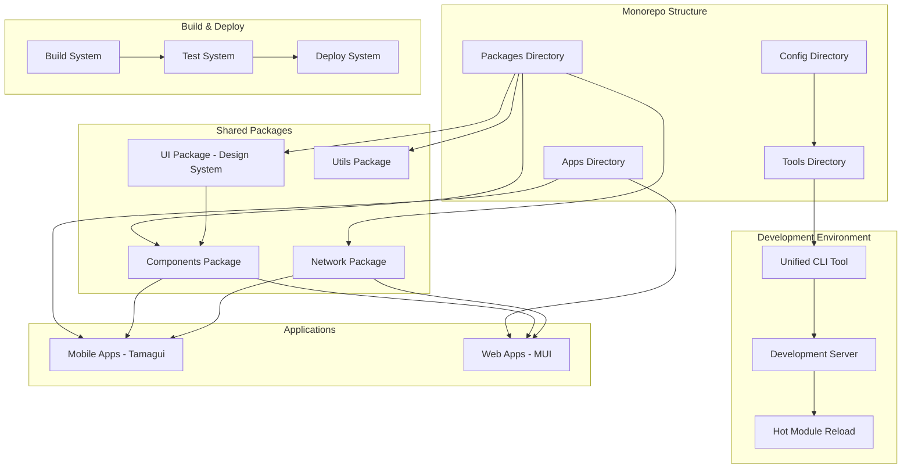
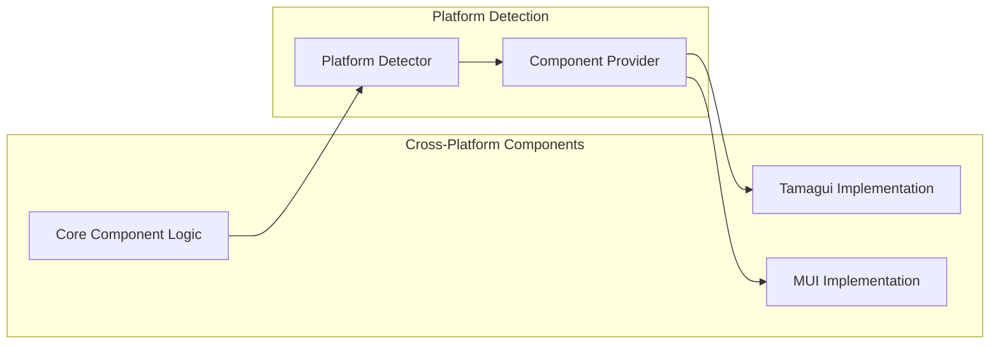
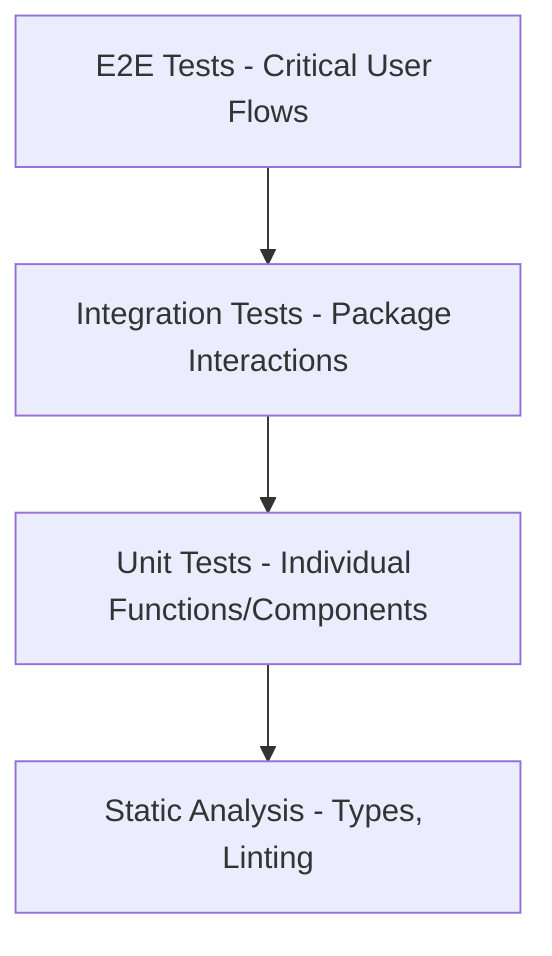
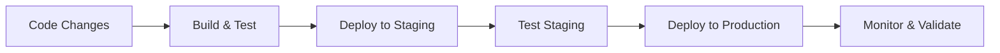

# Design Document

## Overview

This design optimizes the Expo monorepo workflow by implementing a comprehensive development infrastructure that reduces cognitive load and maximizes productivity. The solution provides unified tooling, automated workflows, cross-platform component compatibility, and streamlined development processes for both mobile (Expo/Tamagui) and web (MUI) applications.

## Architecture

### High-Level Architecture



### Package Architecture



## Components and Interfaces

### 1. Unified CLI Tool

**Purpose**: Single entry point for all development operations

**Interface**:
```typescript
interface CLICommands {
  // Development
  dev(app?: string, platform?: 'mobile' | 'web'): Promise<void>
  start(app: string, options?: StartOptions): Promise<void>
  
  // Creation
  createApp(name: string, template: 'mobile' | 'web'): Promise<void>
  createPackage(name: string, type: 'component' | 'utility'): Promise<void>
  
  // Building
  build(app?: string, platform?: Platform[]): Promise<void>
  buildPackages(): Promise<void>
  
  // Testing
  test(scope?: string, watch?: boolean): Promise<void>
  testCoverage(): Promise<void>
  
  // Quality
  lint(fix?: boolean): Promise<void>
  typecheck(): Promise<void>
  format(): Promise<void>
  
  // Deployment
  deploy(app: string, environment: 'staging' | 'production'): Promise<void>
}
```

### 2. Development Server Manager

**Purpose**: Orchestrates development servers for multiple apps and platforms

**Interface**:
```typescript
interface DevServerManager {
  startApp(appName: string, platform: Platform): Promise<DevServer>
  stopApp(appName: string): Promise<void>
  restartApp(appName: string): Promise<void>
  getRunningApps(): DevServer[]
  watchPackages(): void
}

interface DevServer {
  appName: string
  platform: Platform
  port: number
  status: 'starting' | 'running' | 'error'
  url: string
  logs: LogEntry[]
}
```

### 3. Cross-Platform Component System

**Purpose**: Provides unified components that render appropriately on each platform

**Interface**:
```typescript
interface PlatformComponent<T = any> {
  mobile: React.ComponentType<T>
  web: React.ComponentType<T>
  shared?: React.ComponentType<T>
}

interface ComponentProvider {
  registerComponent<T>(name: string, implementations: PlatformComponent<T>): void
  getComponent<T>(name: string): React.ComponentType<T>
  getPlatform(): 'mobile' | 'web'
}
```

### 4. Build System

**Purpose**: Optimized building for different platforms and environments

**Interface**:
```typescript
interface BuildSystem {
  buildApp(appName: string, options: BuildOptions): Promise<BuildResult>
  buildPackage(packageName: string): Promise<BuildResult>
  buildAll(): Promise<BuildResult[]>
  analyzeBundles(appName: string): Promise<BundleAnalysis>
}

interface BuildOptions {
  platform: Platform[]
  environment: 'development' | 'staging' | 'production'
  optimize: boolean
  sourceMaps: boolean
}
```

### 5. Test System

**Purpose**: Comprehensive testing infrastructure

**Interface**:
```typescript
interface TestSystem {
  runUnitTests(scope?: string): Promise<TestResult>
  runIntegrationTests(scope?: string): Promise<TestResult>
  runVisualTests(scope?: string): Promise<TestResult>
  runE2ETests(app: string): Promise<TestResult>
  generateCoverage(): Promise<CoverageReport>
  watchTests(scope?: string): void
}
```

## Data Models

### Configuration Models

```typescript
interface MonorepoConfig {
  apps: AppConfig[]
  packages: PackageConfig[]
  tools: ToolsConfig
  build: BuildConfig
  deploy: DeployConfig
}

interface AppConfig {
  name: string
  type: 'mobile' | 'web'
  path: string
  dependencies: string[]
  platforms: Platform[]
  environment: Record<string, any>
}

interface PackageConfig {
  name: string
  type: 'component' | 'utility' | 'ui'
  path: string
  exports: string[]
  dependencies: string[]
}
```

### Development Models

```typescript
interface DevEnvironment {
  apps: RunningApp[]
  packages: WatchedPackage[]
  servers: DevServer[]
  status: 'idle' | 'starting' | 'running' | 'error'
}

interface RunningApp {
  name: string
  platform: Platform
  server: DevServer
  lastBuild: Date
  errors: Error[]
}
```

## Error Handling

### Error Categories

1. **Configuration Errors**: Invalid monorepo setup, missing dependencies
2. **Build Errors**: Compilation failures, type errors, bundling issues
3. **Runtime Errors**: Application crashes, network failures
4. **Development Errors**: Hot reload failures, server startup issues

### Error Handling Strategy

```typescript
interface ErrorHandler {
  handleConfigError(error: ConfigError): Promise<void>
  handleBuildError(error: BuildError): Promise<void>
  handleRuntimeError(error: RuntimeError): Promise<void>
  handleDevError(error: DevError): Promise<void>
}

class ErrorRecovery {
  // Automatic recovery strategies
  retryBuild(maxAttempts: number): Promise<boolean>
  restartDevServer(): Promise<void>
  clearCache(): Promise<void>
  reinstallDependencies(): Promise<void>
}
```

### Error Reporting

- Structured error logging with context
- Integration with error tracking services (Sentry)
- Developer-friendly error messages with suggested fixes
- Automatic error recovery where possible

## Testing Strategy

### Testing Pyramid



### Test Types

1. **Unit Tests**
   - Individual component testing
   - Utility function testing
   - Business logic testing
   - Framework: Jest + React Testing Library

2. **Integration Tests**
   - Package interaction testing
   - API integration testing
   - Cross-platform compatibility testing
   - Framework: Jest + Supertest

3. **Visual Regression Tests**
   - Component visual consistency
   - Cross-platform UI testing
   - Framework: Chromatic or Percy

4. **E2E Tests**
   - Critical user journey testing
   - Cross-platform flow testing
   - Framework: Detox (mobile) + Playwright (web)

### Test Configuration

```typescript
interface TestConfig {
  unit: {
    framework: 'jest'
    setupFiles: string[]
    testMatch: string[]
    coverage: CoverageConfig
  }
  integration: {
    framework: 'jest'
    testEnvironment: 'node'
    setupFiles: string[]
  }
  visual: {
    framework: 'chromatic' | 'percy'
    browsers: string[]
    viewports: Viewport[]
  }
  e2e: {
    mobile: DetoxConfig
    web: PlaywrightConfig
  }
}
```

## Implementation Details

### 1. Unified CLI Implementation

**Location**: `tools/cli/`

**Key Features**:
- Command discovery and routing
- Progress indicators and logging
- Error handling and recovery
- Configuration validation
- Interactive prompts for complex operations

### 2. Development Server Orchestration

**Location**: `tools/dev-server/`

**Key Features**:
- Multi-app development server management
- Port allocation and conflict resolution
- Hot module reload coordination
- Package change detection and propagation
- Real-time logging and status updates

### 3. Cross-Platform Component System

**Location**: `packages/components/src/platform/`

**Implementation Strategy**:
```typescript
// Platform detection
const Platform = {
  current: typeof window !== 'undefined' ? 'web' : 'mobile',
  isMobile: () => Platform.current === 'mobile',
  isWeb: () => Platform.current === 'web'
}

// Component provider
export const Button = Platform.isMobile() 
  ? require('./Button.tamagui').Button
  : require('./Button.mui').Button
```

### 4. Build System Enhancement

**Location**: `tools/build/`

**Key Features**:
- Parallel building of packages and apps
- Incremental builds with caching
- Bundle analysis and optimization
- Platform-specific optimizations
- Build artifact management

### 5. Enhanced Package Development

**Key Improvements**:
- Watch mode for package development
- Automatic TypeScript declaration generation
- Package dependency validation
- Export validation and testing
- Version management and publishing

## Performance Optimizations

### Build Performance

1. **Incremental Builds**: Only rebuild changed packages and dependent apps
2. **Parallel Processing**: Build multiple packages simultaneously
3. **Caching Strategy**: Cache build artifacts and dependencies
4. **Bundle Splitting**: Optimize bundle sizes for each platform

### Development Performance

1. **Hot Module Reload**: Fast refresh for both packages and apps
2. **Selective Compilation**: Only compile changed files
3. **Memory Management**: Efficient memory usage during development
4. **Network Optimization**: Minimize network requests during development

### Runtime Performance

1. **Code Splitting**: Load only necessary code for each platform
2. **Tree Shaking**: Remove unused code from bundles
3. **Asset Optimization**: Optimize images and other assets
4. **Lazy Loading**: Load components and features on demand

## Security Considerations

### Development Security

1. **Dependency Scanning**: Automated vulnerability scanning
2. **Secure Defaults**: Secure configuration templates
3. **Environment Isolation**: Separate development and production environments
4. **Access Control**: Secure access to development tools and services

### Build Security

1. **Supply Chain Security**: Verify package integrity
2. **Build Reproducibility**: Ensure consistent builds
3. **Artifact Signing**: Sign build artifacts
4. **Secure Storage**: Secure storage of build artifacts and secrets

## Deployment Strategy

### Deployment Pipeline



### Platform-Specific Deployment

1. **Mobile Apps**:
   - Expo Application Services (EAS) integration
   - App Store and Google Play deployment
   - Over-the-air updates
   - Beta testing distribution

2. **Web Apps**:
   - Static site deployment (Vercel, Netlify)
   - Container deployment (Docker)
   - CDN integration
   - Progressive Web App features

### Deployment Configuration

```typescript
interface DeployConfig {
  staging: {
    mobile: EASConfig
    web: VercelConfig
  }
  production: {
    mobile: EASConfig
    web: VercelConfig
  }
  rollback: RollbackConfig
  monitoring: MonitoringConfig
}
```

This design provides a comprehensive solution for optimizing the monorepo workflow while maintaining flexibility and scalability for future growth.